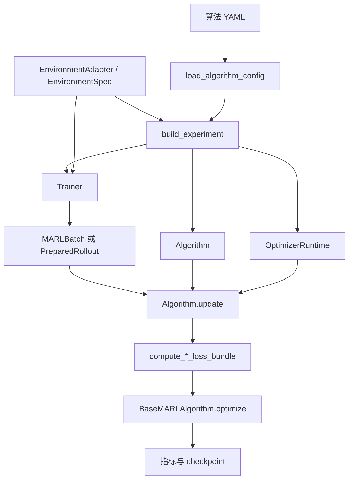

# 架构、目录与数据流

[首页](README.md) · [函数索引](api/README.md) · [训练教程](training.md)

## 目录职责

| 路径 | 负责什么 | 入口与边界 |
|---|---|---|
| [marl](../marl) | 可安装的 Python 包 | [公共导出](../marl/__init__.py) |
| [core](../marl/core) | 批次、模型输出、循环状态、静态布局 | [MARLBatch](api/marl-core-batch.md)、[输出](api/marl-core-output.md)、[状态](api/marl-core-recurrent.md)、[布局](api/marl-core-layout.md)；不放论文目标 |
| [envs](../marl/envs) | 动力学、奖励、数据、动作编解码 | [接口](api/marl-envs-base.md)、[配置](api/marl-envs-config.md)；不放 loss/optimizer |
| [models](../marl/models) | 输入编码器与特征提取 backbone | [窗口编码](api/marl-models-encoder.md)、[MLP](api/marl-models-mlp.md)、[GRU](api/marl-models-gru.md)、[LSTM](api/marl-models-lstm.md)、[GNN](api/marl-models-gnn.md)、[Transformer](api/marl-models-transformer.md) |
| [modules](../marl/modules) | 将特征变成动作、价值或团队 Q | [Actor](api/marl-modules-actor.md)、[Policy](api/marl-modules-policy.md)、[ActionHead](api/marl-modules-action_head.md)、[Critic](api/marl-modules-critic.md)、[Mixer](api/marl-modules-mixer.md) |
| [algorithms](../marl/algorithms) | 算法配置、组件装配、公式接线与更新顺序 | [算法说明](algorithms.md)；具体类直接继承 BaseMARLAlgorithm |
| [training](../marl/training) | 经验生命周期、训练状态、checkpoint | [训练模块](trainers.md)；不按算法名称分支 |
| [examples](../examples) | 可运行入口和组件示例 | [minimal_usage](../examples/minimal_usage.py)、[custom_component](../examples/custom_component.py) |
| [examples/configs/algorithms](../examples/configs/algorithms) | 五份默认 YAML 及专项实验配置 | [字段全集](../examples/configs/README.md)；没有环境维度 |
| [examples/configs/environments](../examples/configs/environments) | 环境独立配置 | 数据、玩家数、episode 长度从这里进入环境 |
| [benchmarks](../benchmarks) | 固定预算训练、独立评估、cross-play、绘图 | [基准说明](../benchmarks/README.md) |
| [tests](../tests) | 数学、形状、梯度、配置、恢复与回归 | [测试导航](training.md#verification) |
| [doc](README.md) | 说明书、教学示例、函数参考 | 学习入口 |
| [docs](../docs) | 历史审计与专题 | 保留日期与原始证据 |

根目录 [pyproject.toml](../pyproject.toml) 声明依赖、打包和检查规则；
[AGENTS.md](../AGENTS.md) 定义开发门禁；[requirements.txt](../requirements.txt) 和
[requirements-dev.txt](../requirements-dev.txt) 提供安装依赖。
`.venv` 是本地解释器，`.pytest_cache/.ruff_cache/.mypy_cache` 是工具缓存，
`local_marl_base.egg-info` 是安装元数据，`benchmark-results` 是忽略的实验产物，
`.git` 是版本库。它们都不是算法实现，不提交缓存、虚拟环境或训练产物。

## marl 根目录公共组件

| 文件 | 输入 → 输出 | 与训练的关系 |
|---|---|---|
| [config.py](api/marl-config.md) | YAML/字典 → 算法 dataclass；配置 → 字典 | 只解析数据，拒绝未知字段和动态类路径 |
| [experiment.py](api/marl-experiment.md) | 环境+配置 → Experiment | 构造一次网络，移设备，再分配 optimizer |
| [extensions.py](api/marl-extensions.md) | 外部解析器/构造器 → Buildable 配置 | 内置组件不注册；外部 YAML 显式传 catalog |
| [objectives.py](api/marl-objectives.md) | Tensor → ObjectiveResult/LossBundle | 数学公式，不做 backward/step |
| [returns.py](api/marl-returns.md) | reward/value/终止 → TD target 或 GAE/return | 逐智能体估计，区分终止和截断 |
| [target_updates.py](api/marl-target_updates.md) | (target, online) → 原地同步 | hard 按更新次数复制；soft 按 tau 平均参数 |
| [value_scaling.py](api/marl-value_scaling.md) | 逐智能体 target → 尺度与诊断 | 输出保留原奖励单位，不是 PopArt |
| [runtime.py](api/marl-runtime.md) | 环境结果/transition → 批张量/replay | 设备、同步环境、内存管理，不定义数学目标 |

## 一次训练沿哪里走

MAPPO：`sample` 输出动作、log-prob、value；环境执行后产生 reward；`add` 保存配对。
写满后 `finish` 先算 GAE，再整理布局。`MAPPO.update` 每个 mini-batch 先更新 actor
再更新 critic，有限 epoch 完成后废弃数据，下一轮重新采集。
离策略则写入 replay，由 trainer 抽取历史 transition，算法计算带目标网络的 TD loss。

## 网络内部的装配边界

actor 使用局部 `encoder → backbone → action head`；集中式网络通过
[encoding.py](api/marl-modules-encoding.md) 组合联合观测或显式 state 节点。图层只在
critic/mixer 中读取多个节点。MADDPG/MASAC 联合输入顺序是“全部观测、全部动作”，
编码器替换观测分支后仍保留动作梯度；不能改成逐体交错排列。

时序输入布局来自 adapter。模型层的 encoder 按布局重排窗口，模块层决定节点/分支共享，
算法层维持输出和目标函数，trainer 决定采样与更新生命周期。具体配置、参数归属和
函数输入输出见[网络教程](networks.md)。

## 张量与对象词典

B=环境/样本数，T=时间，N=智能体数，O=观测维，A=动作维或离散动作数，S=全局状态维，
K=循环层数，H=隐藏宽度。`...` 表示合法前置批维。

| 字段 | 单环境 NumPy | 训练 Tensor | 意义 |
|---|---|---|---|
| observations | [N,O] | [...,N,O] | actor 的局部观测 |
| state | [S] | [...,S] | 集中式 critic/mixer 输入 |
| actions | [N] 或 [N,A] | long [...,N] 或 float [...,N,A] | 实际动作 |
| rewards | [N] | [...,N] | 各智能体自己的收益 |
| action_mask | bool [N,A] | bool [...,N,A] | True 合法；连续为 None |
| terminated/truncated | episode 级 bool | bool [...,N] | 环境标记扩展到 N |
| old_log_prob/old_values | 不属于环境 | [...,N] | 采样策略快照 |
| advantages/returns | 不属于环境 | [...,N] | 策略权重/价值标签 |

`EnvironmentStep` 是环境时刻结果。`Transition(current, actions, next)` 的奖励读
`next.rewards`。`MARLModelOutput` 是前向结果，`MARLBatch` 是训练输入，
`PreparedRollout` 额外管理 PPO 数据消费权。

循环 actor 状态 `[K,B,N,H]`、critic 状态 `[K,B,H]`，LSTM 各有 h/c。缓存保存处理当前
观测**之前**的状态，输出是之后的状态。先按 `[T,B,N]` 算 GAE，再转为 `[B,T,N,...]`
切片，不能打乱片段内部时间。

窗口历史的 W 是另一维：局部 `[B,T,O]` 重排为 `[B,T,W,C]`，每个窗口编码后为
`[B,T,H+P]`，P 是当前特征数。窗口之间不携带状态；仅后续跨步循环 backbone 使用上面
的 h/c 契约。带历史编码的 MLP 网络仍使用独立 transition 或展平 rollout。
